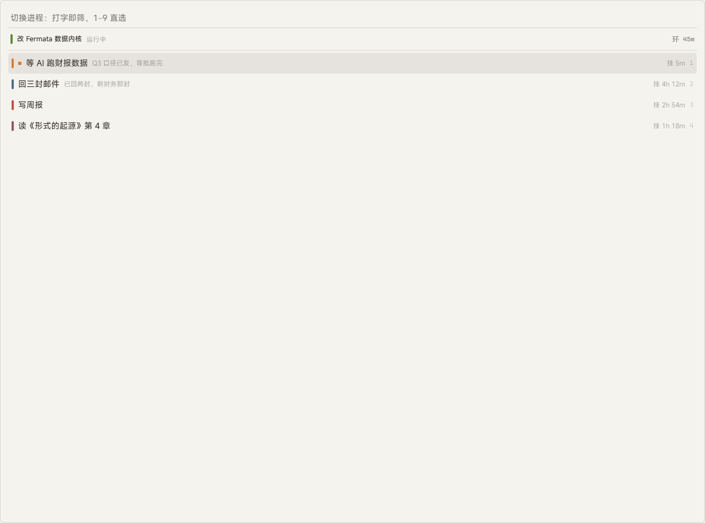
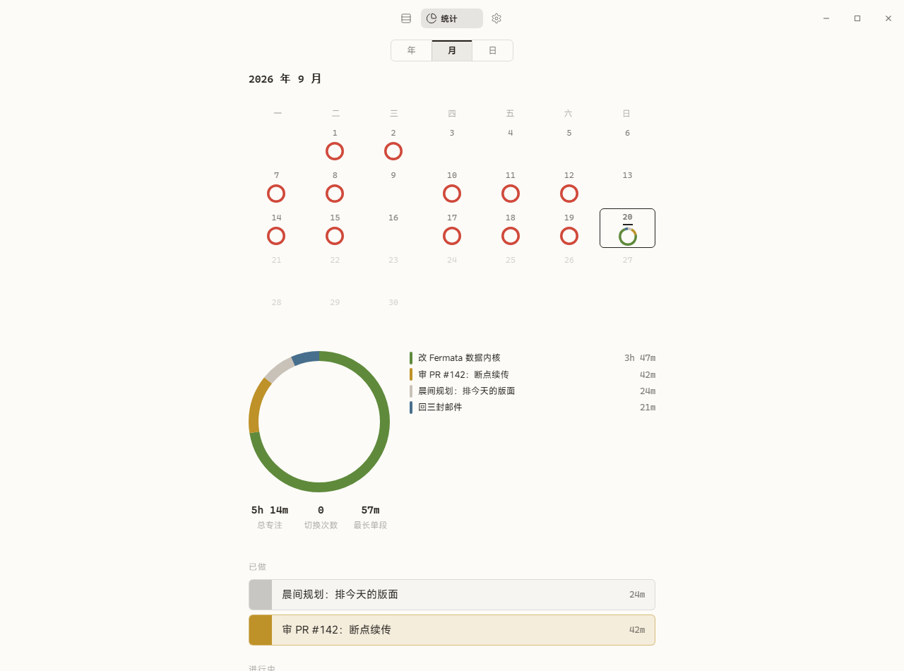
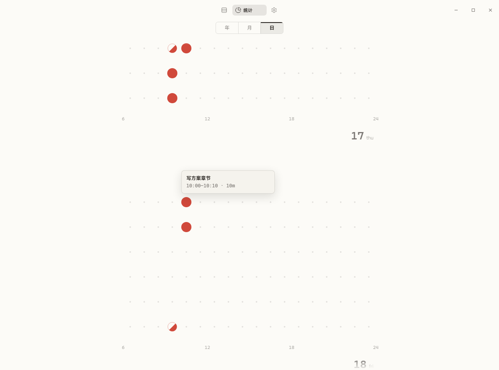

# Fermata

**把一天排成一页版面。**

普通任务列表记录"该做什么"，Fermata 额外记录"做到哪了"。
它为全天与 AI 协作、频繁切换的人而造：内核是一台任务调度器——挂起、恢复、断点、计时、休止符；报纸式排版只是这层调度的呈现。数据全在本机，无账号、无云、无遥测。

## 一天

早上，从稿库把今天拖进版面；折线上只放一件事，其余的在下面慢慢等着。
工作时，`Alt+Q` 一按即换——切走的那件会替你留一句话，下次回来从断点接着做。
时间片走满，休止符在屏幕右下角安静地等你，不催、不闹、不自动消失；回不回来，你说了算。
晚上翻统计页，看今天的时间是怎么过去的，顺手把明天写进稿库。

## 界面

|  |  |
| --- | --- |
|  |  |
| **切换浮层**——切走的是任务，留下的是断点 | **休止符**——它不催你，它只是在那里等你 |

|  |  |
| --- | --- |
|  |  |
| **月**——这个月的每一天，一眼可辨 | **日**——今天的时间是怎么过去的 |

暗 · 工作台——另一套主题，给夜里干活的人

## 安装

| 形态 | 文件 |
| --- | --- |
| 安装包（推荐） | `publish/Fermata-1.0.0-setup.exe` |
| 绿色单文件 | `publish/Fermata-1.0.0-portable.exe` |

要求 Windows 10/11（WebView2 随系统自带）。首次启动即为空版面，不含任何演示数据。
从 gika 时代升级：旧数据库首启自动复制迁移，原目录原样保留。

上手操作与开发者运维见 [docs/manual.md](docs/manual.md)。

## 制作

由 **iceforYuri** 设计与开发。
界面字体 MiSans（小米，免费商用，子集内嵌），许可见 [src/assets/fonts/MiSans-LICENSE.txt](src/assets/fonts/MiSans-LICENSE.txt)。
