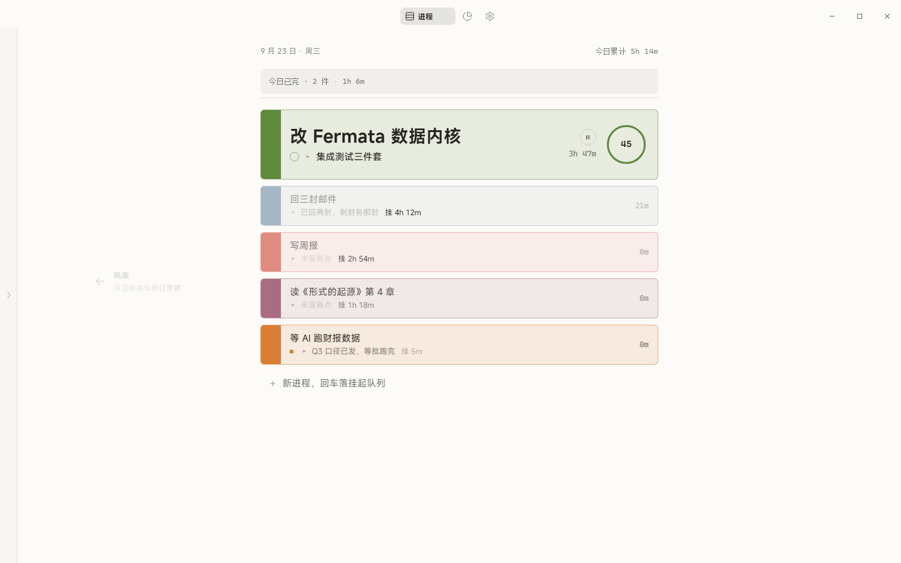
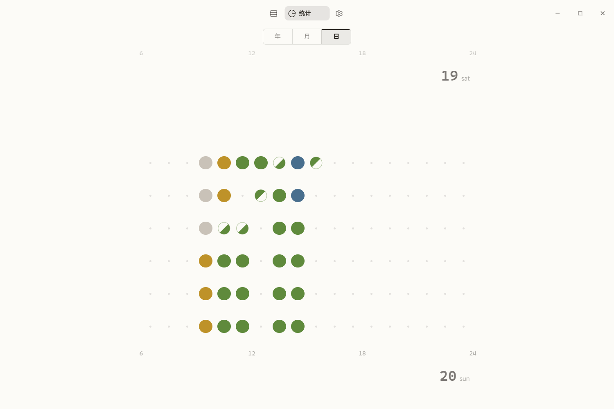
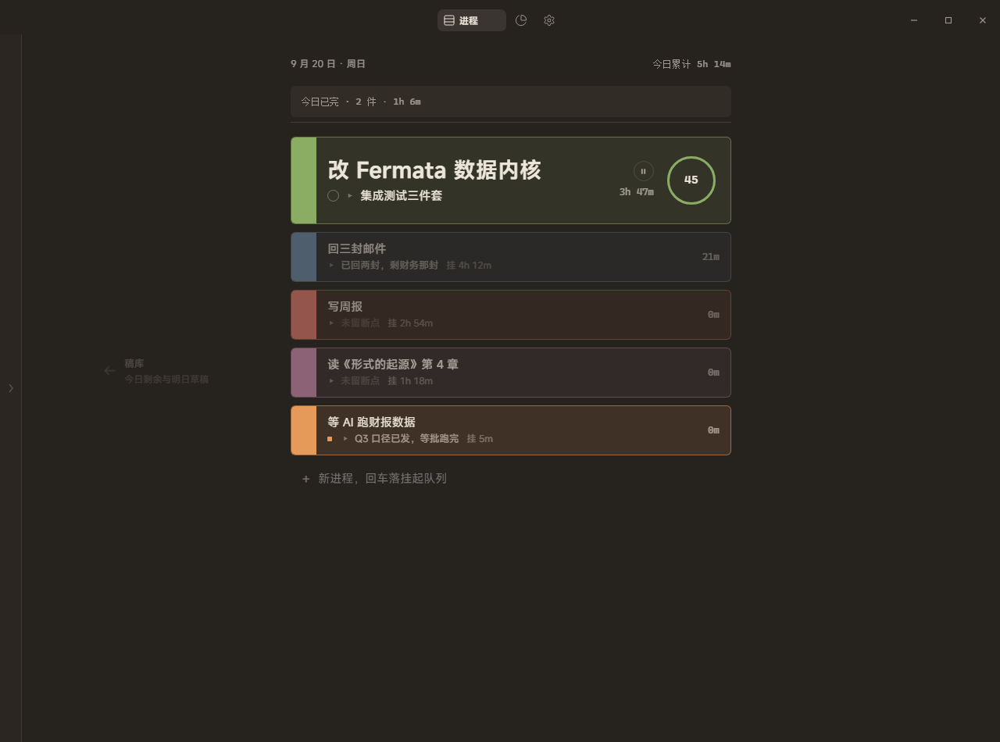

# Fermata

把一天排成一页版面。

一个 Windows 桌面效率工具：管理并行工作的挂起与恢复，度量专注时间。给全天与 AI 协作、频繁切换、容易忘记"上一件做到哪"的人。

## 为什么是它

切走容易，回来难。

任务列表替你记"该做什么"，却不记"做到哪了"。Fermata 的内核是一台任务调度器——进程状态机、断点、计时、休止符；报纸式排版只是它的呈现。你切走的时候，它替你把上下文钉在版面上。

## 功能巡礼

**进程，不是任务。** 一天的事情排在一页版面：折线之上只放一件正在做的，其余在下方挂起队列里随时间老化渐褪。完成点行首色脊，3 秒可撤销，随后沉降进完成档案。

**断点，不是备注。** 切走时留的一句话压上步骤栈顶；当前步骤槽永远指着"接着做哪"。回来，从断点继续。

**休止符。** 时间片走满、或连轴 90 分钟，主屏右下角弹一张实心暖卡——不抢焦点、无超时、不催促。休息没有固定时长；恢复，永远由你显式开始。

**时间格。** 一天画成 18×6 的圆点网格（06–24 时，每格 10 分钟）：色标成串，悬停见进程与起止。空隙本身，也是数据。

**切换浮层。** `Alt+Q` 唤出，进程版 Alt+Tab：过滤与新建二合一、数字键直选、断点内嵌——两次回车完成一次完整切换。

**稿库。** 左缘一条细栏，今日剩余与明日草稿；拖一条进版面，即成为进程。

亮 · 淡暖 / 暗 · 工作台，两套主题；数字一律等宽；玻璃只盖自家内容。

## 安装

- 安装包：`publish/Fermata-1.0.0-setup.exe`
- 绿色单文件：`publish/Fermata-1.0.0-portable.exe`
- 要求 Windows 10/11（WebView2 随系统自带）。首启即是空版面，无演示数据。
- 使用手册（上手 + 运维）：[docs/manual.md](docs/manual.md)

## 数据

local-first。SQLite 在本机，事件日志 append-only、可导出。没有账号，没有云，没有遥测。

## 制作

由 **iceforYuri** 设计与打磨——一个人，一台机器，一份版面。
界面字体 MiSans（小米，免费商用，子集内嵌，许可见 `src/assets/fonts/MiSans-LICENSE.txt`）。
