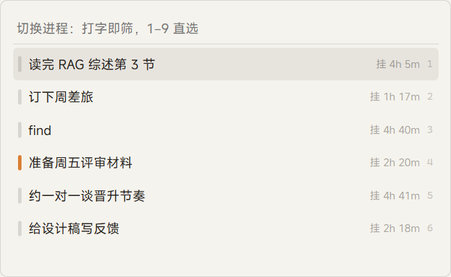
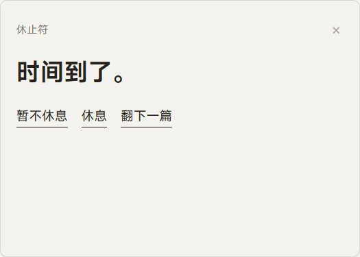
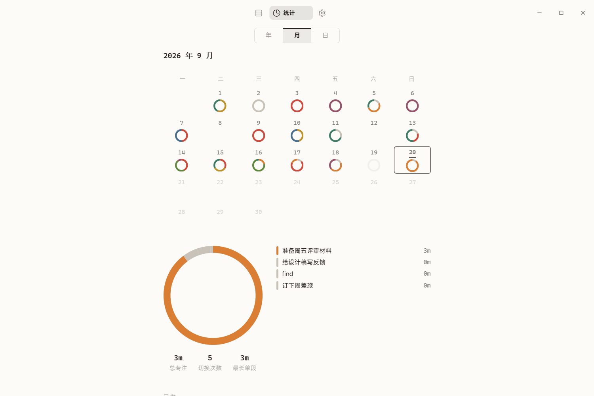

# Fermata

**把一天排成一页版面** —— Windows 桌面效率工具：并行工作的挂起、恢复与专注度量

## 关于

Fermata 面向全天与 AI 协作、频繁切换任务的知识工作者。普通任务列表记录"该做什么"，Fermata 额外记录"做到哪了"：内核是一台任务调度器（进程状态机 + 断点 + 计时 + 休止符），报纸式排版是它的呈现层。

数据 local-first：SQLite 存于本机，事件日志 append-only、可导出。无账号、无云、无遥测。

## 核心功能

1. **进程版面**——一天一页：折线上是唯一运行中的进程，下方挂起队列按挂起时长渐褪；完成点行首色脊，3 秒可撤销，超时沉降入完成档案
2. **断点与步骤栈**——切走留断点（压上栈顶），当前步骤槽始终指向"接着做哪"；新步骤置顶、原位勾选、断点条与步骤同栈管理
3. **切换浮层**——`Alt+Q` 唤出（可改）：过滤/新建二合一输入行、数字键 1–9 直选、断点内嵌流程、等 AI 进程排前
4. **休止符**——时间片走满或连续工作超阈值（默认 90 分钟）双触发；主屏右下角实心暖卡、不抢输入焦点、无超时；✕ = 进入休息；休息态在弹窗与主窗休息页双渲染，恢复必须显式
5. **统计三视角**——年（12 月环网格）/ 月（月历迷你日环 + 大环 + 当天视图）/ 日（18×6 时间格网格：06–24 时、每格 10 分钟、悬停浮窗、斜半圆表达不满格）；计划带预定日，与稿库同源
6. **空闲感知**——无键鼠超阈值（默认 5 分钟）自动暂停计时，回归时确认"刚才还在做吗"
7. **双主题与排版纪律**——亮 · 淡暖 / 暗 · 工作台；色标暖调 7 色（语义用户自定义）；数字一律等宽；界面内嵌 MiSans

## 界面

切换浮层与休止符弹窗（真实窗口实拍）：

统计页 · 日视角时间格（悬停浮窗）与月视角：

双主题（亮 · 淡暖 / 暗 · 工作台）：

## 安装

| 形态 | 文件 |
| --- | --- |
| 安装包（推荐） | `publish/Fermata-1.0.0-setup.exe` |
| 绿色单文件 | `publish/Fermata-1.0.0-portable.exe` |

要求 Windows 10/11（WebView2 随系统自带）。首次启动即为空版面，不含任何演示数据。
从 gika 时代升级：旧数据库首启自动复制迁移，原目录原样保留。

使用手册（上手操作 + 开发者运维）：[docs/manual.md](docs/manual.md)

## 制作

由 **iceforYuri** 设计与开发。
界面字体 MiSans（小米，免费商用，子集内嵌），许可见 [src/assets/fonts/MiSans-LICENSE.txt](src/assets/fonts/MiSans-LICENSE.txt)。
