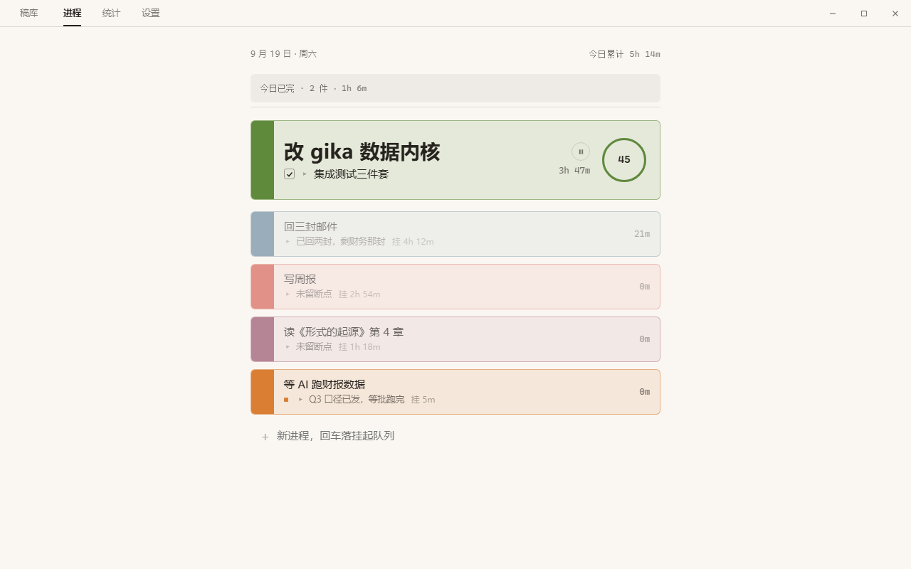
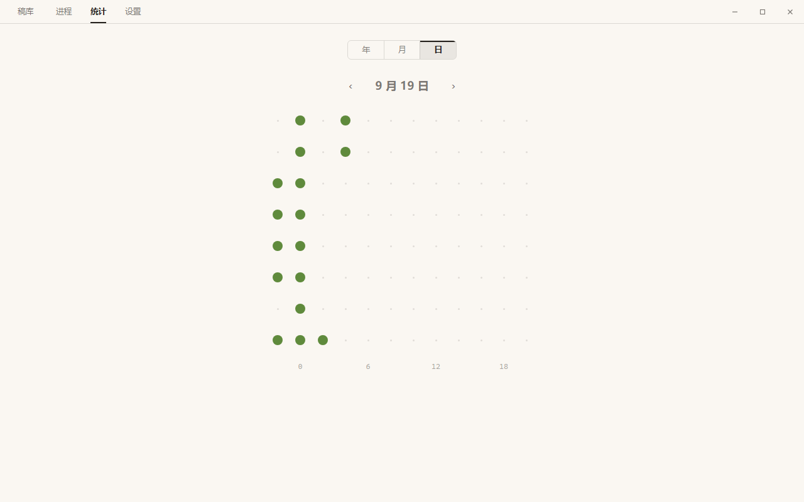

# gika

把一天排成一页版面，管理并行工作的挂起与恢复，度量专注时间。Windows 桌面效率工具（Tauri 2 + React + TypeScript + SQLite）。




## 系统要求

- Windows 10/11（Win11 由 DWM 自动提供圆角窗口）
- 系统自带或已装 WebView2 Runtime（Win11 预装）
- 开发环境：Node 22+、pnpm 9+、Rust stable（x86_64-pc-windows-msvc）

## 运行（开发）

```bash
pnpm install
pnpm tauri dev
```

种子演示数据（一周密集 + 可选 120 天稀疏）：

```bash
pnpm seed        # 写入 ./src-tauri/gika-seed.db
pnpm seed:deep   # 加铺过去 ~120 天
pnpm tauri dev   # 用种子库：GIKA_DB_PATH=...\src-tauri\gika-seed.db
```

默认运行库在 `%APPDATA%/com.gika.dev/gika.db`；`GIKA_DB_PATH` 可覆盖。

## 截图 / 验证脚本

```bash
pnpm vite dev                 # 浏览器 mock 模式
node scripts/shot.mjs         # 全页面截图矩阵 → docs/screenshots/
node scripts/verify-m1.mjs    # 进程页交互断言
node scripts/verify-m3.mjs    # 统计页钻取断言
node scripts/verify-m4.mjs    # 设置页双态断言
# 真实窗口（WebView2 CDP）：
# WEBVIEW2_ADDITIONAL_BROWSER_ARGUMENTS=--remote-debugging-port=9222 pnpm tauri dev
node scripts/verify-m2.mjs        # 系统层六项
node scripts/verify-m2-idle.mjs   # 空闲回归（需 GIKA_IDLE_SECS=5 实例）
node scripts/verify-m4-real.mjs   # 设置真实链路
```

## 打包

```bash
pnpm tauri build
```

产物：`src-tauri/target/release/bundle/nsis/gika_1.0.0_x64-setup.exe`（NSIS 安装包，含 WebView2 引导）。

## 仓库结构

```
src/                  前端（React + TS）
  api/                六原语与数据层薄封装（组件不许直接碰 Tauri）
  pages/              进程页 / 统计页 / 设置页 / 休息页 / 浮层两窗
  store/              board（数据）/ ui（面板）/ scheduler（调度 tick）/ actions
  styles/             tokens.css（视觉底座定稿）+ app.css
src-tauri/
  src/db/             SQLite 内核：schema 迁移 / ops（状态机+事件）/ queries（统计）
  src/commands.rs     命令层（全部 async + store-changed 广播）
  src/sys.rs          六原语 / 预建浮层 / 热键 / 空闲看门狗 / debug 替身
  src/bin/seed.rs     种子（--deep 铺 120 天）
docs/                 设计文档与验收证据（screenshots/ 每阶段一册）
```

## 字体

随包内置 MiSans（小米免费商用字体，子集 GB2312+ASCII，三档字重共 ~2.7MB），许可说明见 `src/assets/fonts/MiSans-LICENSE.txt`。

## 词汇与纪律

- 词汇表（进程/挂起/断点/折线/休止符…）见 [CONTEXT.md](docs/../CONTEXT.md)
- 设计宪法与工作协议见 [AGENTS.md](AGENTS.md)
- 文档未覆盖处的实现决策留痕于 [docs/deviation.md](docs/deviation.md)
