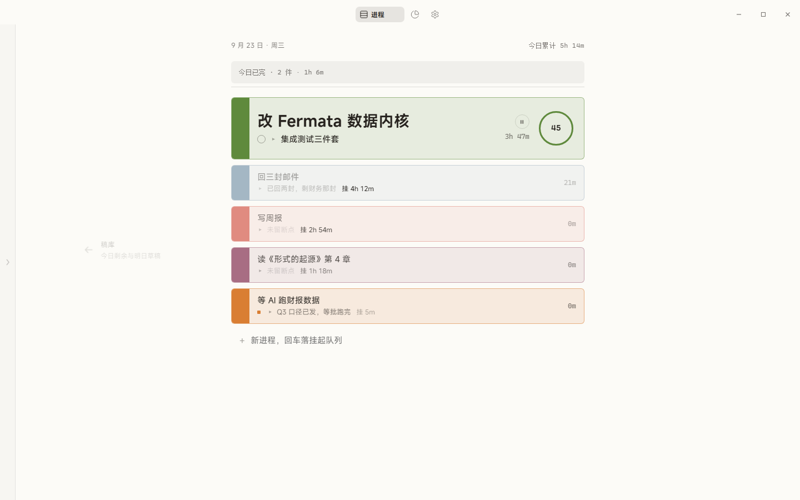
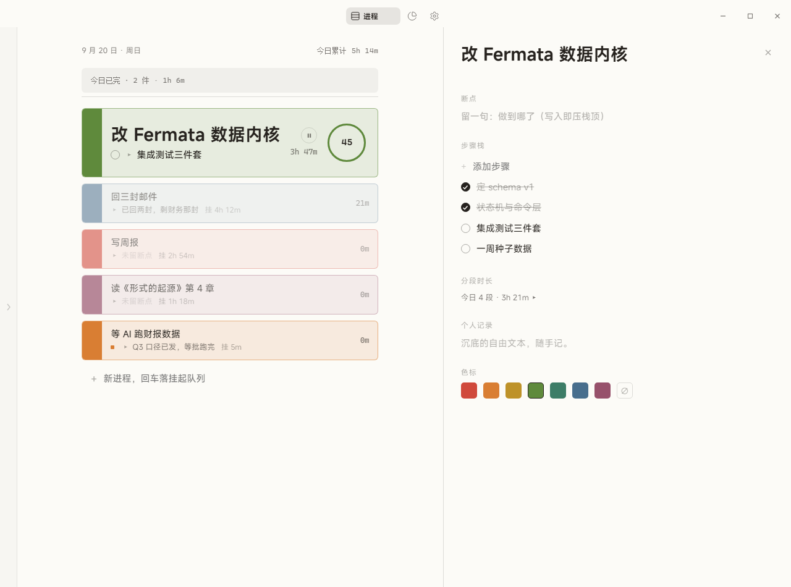
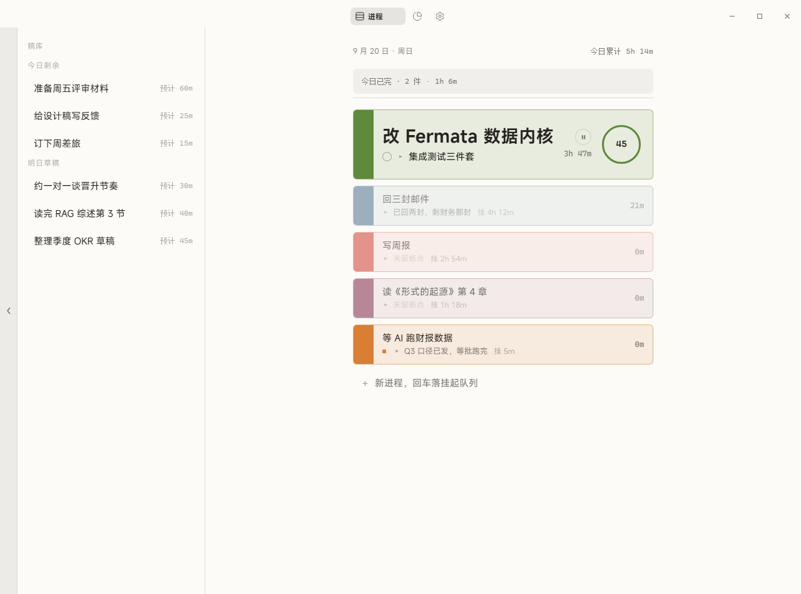
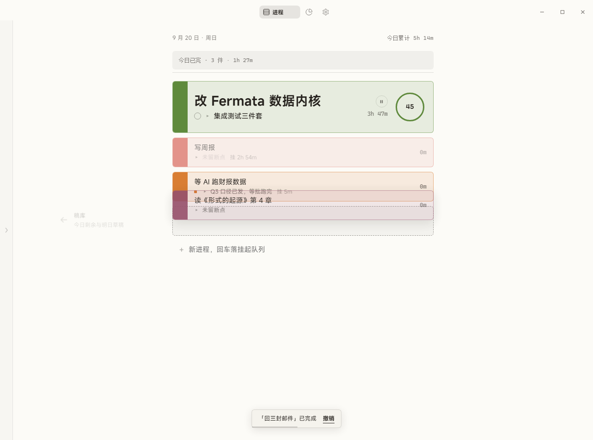
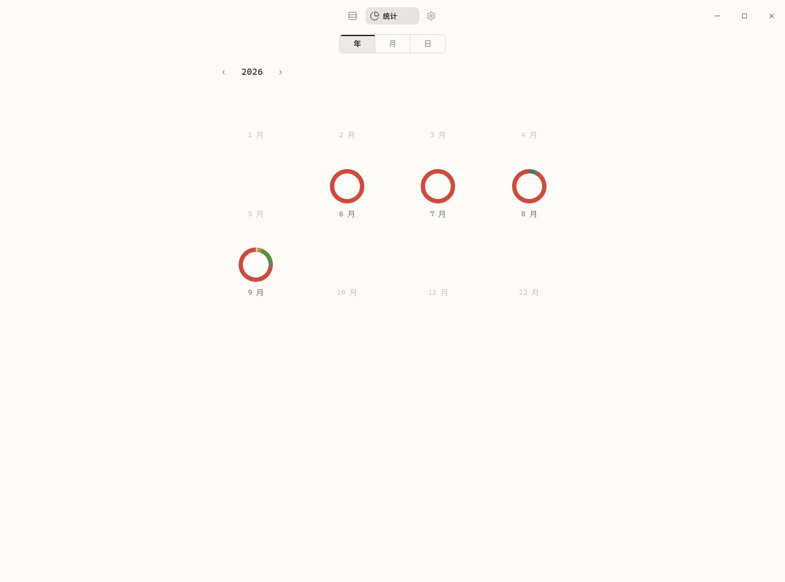
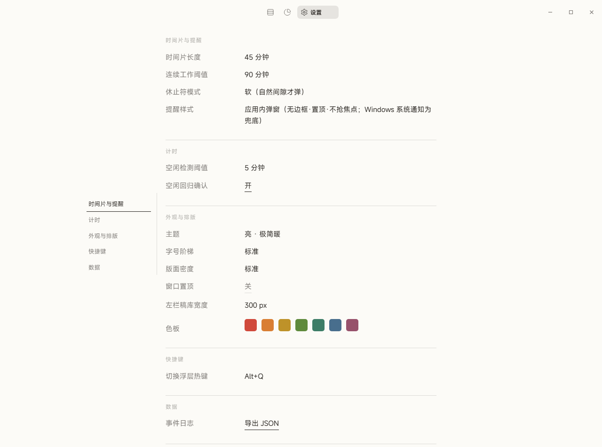

# Fermata 使用手册

> 产品页见根目录 [README.md](../README.md)。本手册 = 上手操作 + 开发者运维。截图均可在 `docs/screenshots/release/` 找到对应暗色版（`*-dark.png`）。

## 上手

### 进程页（Tab 1 · 版面）



- 一天的事情排成一页：**折线**上方是已完，折线上是唯一在做的**运行**进程，下方是**挂起**队列
- **开始**：点挂起行（或把它拖过折线）→ 断点卡从旧进程行下方展开，留一句话（可空）回车即切换
- **完成**：点行首色脊确认条，3 秒内可撤销；超时入**完成档案**（点顶部已完栏可查、可重新打开）
- **步骤栈**：详情栏里新步骤置顶；写断点 = 往栈顶压一条断点条；当前步骤槽永远显示栈顶——"接着做哪"不用想
- **时间环**：活跃行右端，时间片倒计时；点环可临时改本次片长（25/45/90/自定义）；最后 5 分钟环会呼吸
- **等 AI**：挂起的子状态，不褪色、切换浮层里排前；在详情栏或切换浮层按 `A` 标记

详情栏（点进程唤出，右栏推拉）：



稿库（左缘细栏点开，拖入中列即成进程）与拖拽重排（弹性补位 + 落点虚影）：




### 切换浮层（Alt+Q）


进程版 Alt+Tab：打字即筛、无匹配即"新建并切换"、数字键 1–9 直选、`A` 标等 AI、Enter 切换（随后可留断点，再 Enter 走人）、Esc 收起。

### 休止符


时间片走满或连续工作 90 分钟触发。三选：暂不休息 / 休息 / 翻下一篇；✕ = 进入休息。休息无固定时长、无自动结束。休息态下主窗 Tab 1 是玻璃休息页（灰满环 + ▶ 继续，`Enter`/`Esc` 等价）：


### 统计页（Tab 2）


- 视角胶囊 **年 / 月 / 日**；年点月环进月、月双击日期进日、日视角纵向滚动（上滚历史、下界今天）
- 月历每格迷你日环（按色标聚合）；大环每进程一片；当天视图：已做 / 进行中 / 未做 / 计划编辑，与稿库同源
- 日网格 18×6 = 06–24 时、每格 10 分钟；不满格画 45° 斜半圆；悬停圆点看进程与区间内时长：


年视角（12 月环，只显示有记录的年份范围）：



### 设置页（Tab 3）



左侧分组导航：时间片与提醒 / 计时 / 外观与排版 / 快捷键 / 数据。全部双态控件——点文字原地变形，Enter 或失焦提交，Esc 还原。可改全局热键（默认 Alt+Q）、主题（亮 · 淡暖 / 暗 · 工作台）、置顶等。

## 运维（开发者）

```bash
pnpm install
pnpm tauri dev        # 开发态
pnpm tauri build      # 产物在 src-tauri/target/release/，拷贝到 publish/ 即发布位
```

- 演示数据：`pnpm seed` / `pnpm seed:deep`；`FERMATA_DB_PATH` 指定库文件
- 数据库：`%APPDATA%/com.fermata.app/fermata.db`（local-first SQLite，事件日志 append-only，设置页可导出 JSON）
- 验证：`cargo test` + `node scripts/verify-m1|m2|m3|m4`；发布验收总表 `docs/screenshots/release/checklist.md`
- 结构：`src/`（api 薄封装 · pages · store · styles/tokens）｜`src-tauri/`（db 内核 · commands · sys 六原语）｜`docs/`（设计合同 01–04 · ADR · 证据）
- 分支：`dev` 开发主线 / `main` 发布 / `feature/*` 功能分支
- 词汇与纪律：[CONTEXT.md](../CONTEXT.md)、[AGENTS.md](../AGENTS.md)
